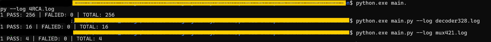
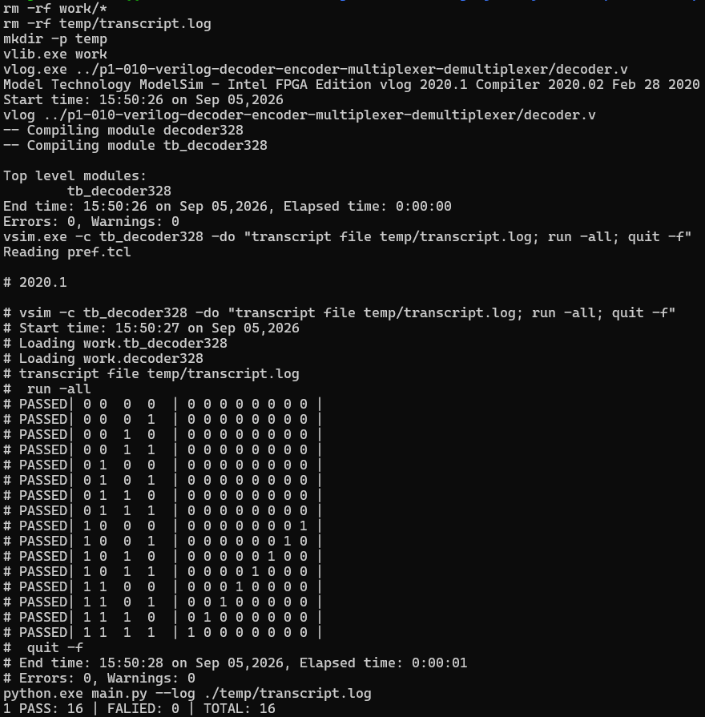

Before runing: install Modelsim, make.exe (In this DIR I used WSL to run Makefile)
In this issue, I was learn how to automation the simulation.
The first, I used default ouput format for $display in Modelsim
Comparison actual and expected, and cout pass/fail.
Used Python to exprting report: total, pass rate, list of fail case

And in the end, itergrate, add into Makefile to run auto affter saved Verilog file.

